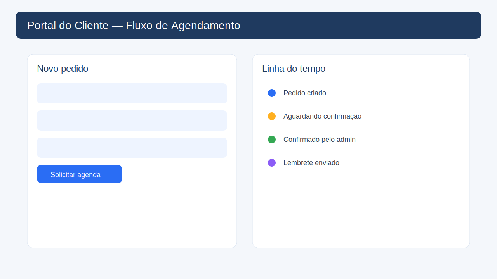
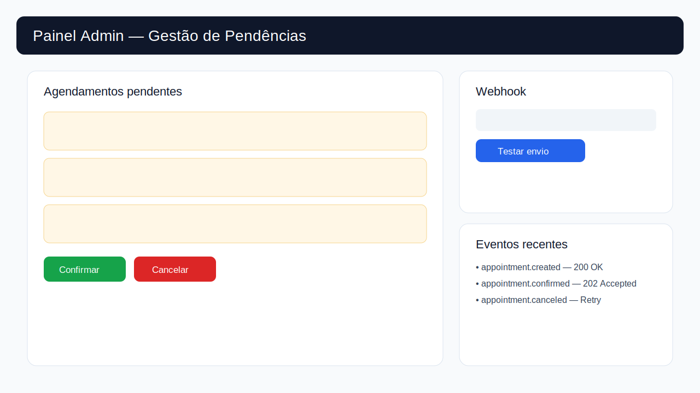
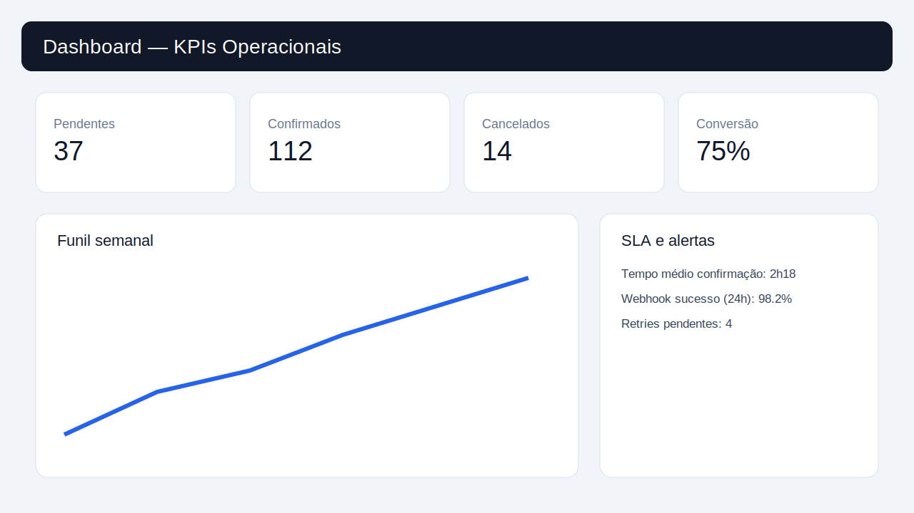
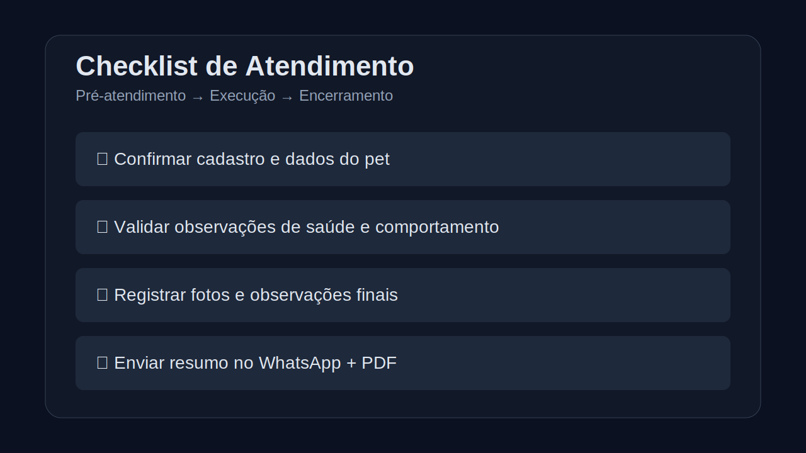
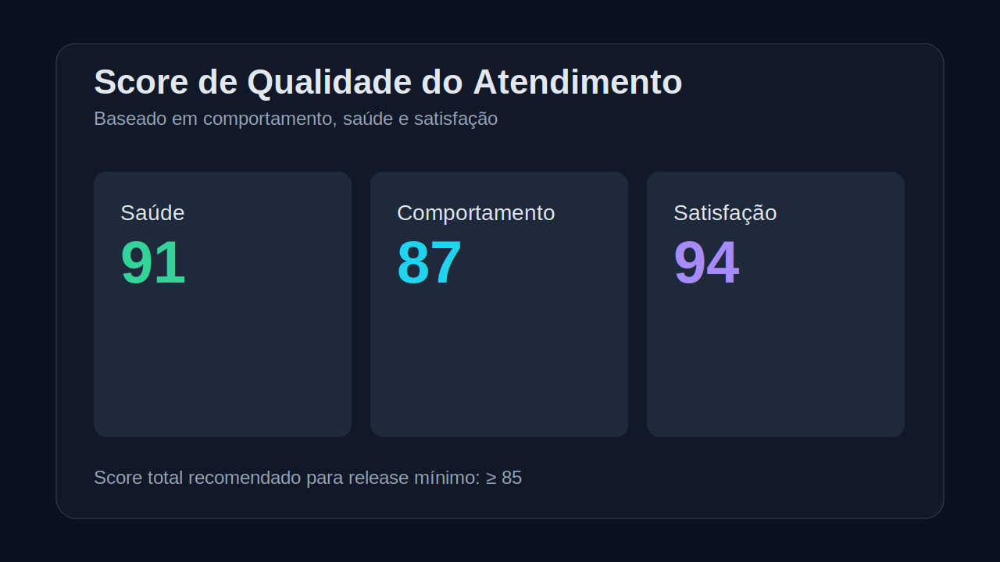
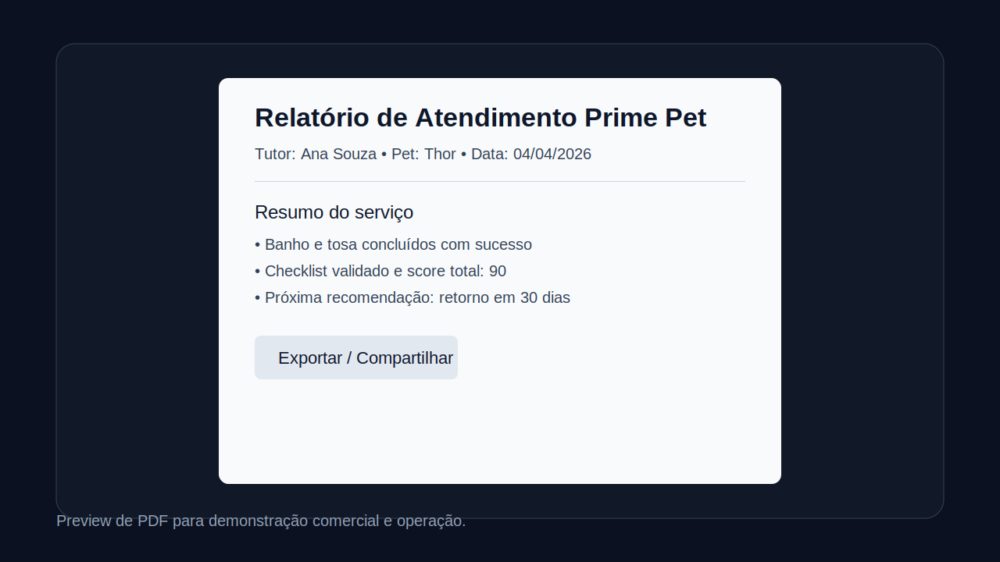
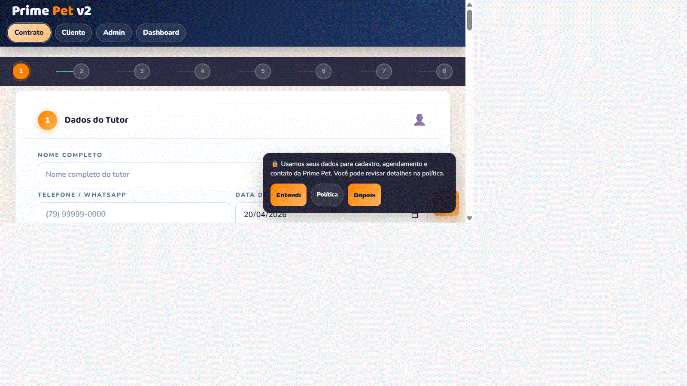

# 🐾 Prime Pet

[](https://prime-pet.vercel.app)


## 📌 Visão geral

## 🆕 Estado atual do projeto (v2 em evolução)

O repositório agora está organizado para **migração progressiva para API v2 (SaaS multi-tenant)**:

- Backend novo em `api-v2/` (NestJS + Prisma);
- Frontend legado ainda ativo, com bridge para alternância gradual `legacy`/`v2`;
- Documentação segmentada em `docs/v2`, `docs/legacy` e `docs/planning`.

Consulte o índice de docs em `docs/README.md`.

O **Prime Pet** é uma aplicação web com:

- **Formulário público (`index.html`)** para pré-cadastro e solicitação de agendamento;
- **Portal do cliente (`client.html`)** com login, histórico, perfil, status de pedidos e assistente de dúvidas;
- **Painel admin (`admin.html`)** com controle de agenda, confirmações/cancelamentos, histórico e exportações.
- **Dashboard de métricas (`dashboard.html`)** com KPIs operacionais em Firestore.

O fluxo é simples:

1. O tutor preenche o pré-cadastro no formulário.
2. O sistema valida campos, bloqueia datas indisponíveis e abre WhatsApp com resumo.
3. O cliente conclui no portal (login Google/e-mail), acompanha e gerencia pedidos.
4. O admin acompanha pendências e decide confirmar/cancelar/liberar agenda.

## 🎯 Clareza da proposta (nível produto)

### Problema

Clínicas e operações pet perdem eficiência quando o agendamento digital fica fragmentado entre formulário público, acompanhamento do tutor e gestão interna.

### Público

- Tutores de pets que precisam solicitar e acompanhar atendimentos com rapidez.
- Equipe operacional/admin que precisa confirmar, organizar e monitorar agenda em tempo real.

### Uso real

O produto conecta o fluxo ponta a ponta:

1. Tutor solicita atendimento no formulário público.
2. Tutor acompanha status e histórico no portal do cliente.
3. Operação valida, confirma/cancela e monitora métricas no admin/dashboard.

Isso reduz ambiguidade operacional e transforma a proposta em valor prático e mensurável para adoção.

## ✨ Funcionalidades

- Pré-cadastro completo (tutor, pet, saúde, comportamento e serviços).
- Calendário com bloqueio de finais de semana, datas passadas e feriados relevantes.
- Portal cliente com:
  - login Google/e-mail,
  - histórico de pedidos,
  - numeração amigável de pedidos,
  - fluxo visual de etapa (pendente/confirmado/cancelado),
  - edição/remarcação quando permitido,
  - assistente rápido (intenção + FAQ no Firebase + fallback suporte).
- Painel admin com:
  - leitura de agendamentos em tempo real,
  - confirmação/cancelamento/liberação de slots,
  - histórico de clientes, ações e erros,
  - exportação em CSV/JSON/Google Agenda,
  - webhook de notificação para automações externas (n8n/Make/Zapier),
  - métricas locais de funil.
- Política de privacidade/LGPD dedicada (`privacy.html`).

## 🧱 Stack utilizada

- **HTML5**
- **CSS3** (responsivo, com variáveis CSS)
- **JavaScript puro (Vanilla JS)**
- **Firebase Authentication** (Google/e-mail)
- **Cloud Firestore** (nova camada recomendada)
- **Camada de compatibilidade RTDB API → Firestore** (`scripts/firestore-rtdb-compat.js`)
- **Firebase Cloud Functions** (automações agendadas)
- **Google Fonts**
- **WhatsApp API (`wa.me`)**
- **PWA** (manifest + service worker)

## 🚀 Executando localmente

Como é um projeto front-end estático, não há instalação de dependências de build.

```bash
git clone https://github.com/fernando-msa/prime-pet.git
cd prime-pet
```

Depois, abra o `index.html` no navegador.

### Verificação rápida (Smoke QA)

```bash
./scripts/qa_smoke.sh
```

No Windows PowerShell:

```powershell
powershell -ExecutionPolicy Bypass -File .\scripts\qa_smoke.ps1
```

### API v2 (validação local no Windows)

No PowerShell, prefira `npm.cmd` para evitar bloqueio de política de execução do `npm.ps1`:

```powershell
cd .\api-v2
npm.cmd install
npm.cmd run lint
npm.cmd run build
npm.cmd audit --audit-level=moderate
```

## 📁 Estrutura do projeto

```text
prime-pet/
├── index.html                  # Formulário público + pré-cadastro
├── client.html                 # Portal do cliente (login, pedidos, perfil, assistente)
├── admin.html                  # Painel admin (agenda, histórico, exportações, webhook)
├── dashboard.html              # Dashboard de métricas (Firestore)
├── privacy.html                # Política de privacidade e LGPD
├── manifest.webmanifest        # Manifesto PWA
├── sw.js                       # Service Worker (cache offline)
├── firestore.rules
├── firestore.indexes.json
├── scripts/firestore-rtdb-compat.js
├── functions/
│   ├── index.js                # Cloud Functions (alerta de vacina + dispatcher)
│   └── package.json
├── favicon.svg
├── LICENSE
└── README.md
```

## ⚙️ Configuração rápida (Firebase)

O projeto usa Firebase diretamente no front-end. Confira:

- credenciais no bloco `firebaseConfig` de `index.html`, `client.html` e `admin.html`;
- permissão administrativa por **custom claim** `admin=true` no Firebase Auth;
- validação de host autorizado no front (`localhost`, `prime-pet.web.app`, `prime-pet.firebaseapp.com`, `prime-pet.vercel.app`).

Também é possível customizar:

- telefone/links de WhatsApp;
- textos de cabeçalho e rodapé;
- política de privacidade;
- FAQ do assistente via nó `assistente_faq` no Realtime Database.

## 🔐 Migração concluída: aplicação em Firestore

- `firestore.rules` com regras por usuário autenticado (ownerUid) e perfil admin por custom claim + fallback em `admin_users/{uid}`;
- `firestore.indexes.json` com índices para consultas do dashboard e agenda;
- `scripts/firestore-rtdb-compat.js` para manter o código de `client.html` e `admin.html` sem dependência do Realtime Database;
- `dashboard.html` para leitura de métricas usando coleção `appointments`;
- `functions/index.js` com:
  - `enqueueVaccineAlert` (callable) para agendar alerta de vacina;
  - `dispatchVaccineAlerts` (schedule) para enviar alertas pendentes para `notification_outbox`;
  - callables de operação segura (`setOperationalWebhook`, `getOperationalWebhook`, `testOperationalWebhook`, `notifyOperationalEvent`).

### Modelo mínimo sugerido no Firestore

- `admin_users/{uid}`: controle de acesso admin por usuário (`enabled: true`) sem depender apenas de custom claim
- `appointments/{id}`: `ownerUid`, `ownerName`, `petName`, `date`, `hour`, `status`, `createdAt`
- `profiles/{uid}`: preferências do cliente
- `vaccine_alerts/{id}`: fila de lembretes
- `notification_outbox/{id}`: integração com WhatsApp/e-mail via worker externo

### Acesso ao `admin.html` após migração

Modelo recomendado:

1. Definir **custom claim** no Auth: `admin=true` (fonte principal);
2. Opcional: criar `admin_users/{uid}` no Firestore como fallback operacional controlado por backend:

```json
{ "enabled": true, "email": "seu-email@dominio.com" }
```

### Deploy (Firestore + Functions)

```bash
firebase deploy --only firestore:rules,firestore:indexes
firebase deploy --only functions
```

## 🎬 Landing/demo visual

Foi adicionada uma página de demonstração mais visual para apresentação comercial e validação do fluxo mínimo:

- `demo.html` (hero, cards de fluxo, galeria de screenshots e próximos passos)
- screenshots em `assets/screenshots/`:
  - `checklist-demo.svg`
  - `score-demo.svg`
  - `pdf-demo.svg`

Abra o arquivo localmente no navegador. Exemplos:

```bash
# macOS
open demo.html

# Linux
xdg-open demo.html

# Windows
start demo.html
```

## 📸 Screenshots do produto em execução

### Fluxos principais





### Evidências de demo





### GIF curto de navegação



## 🧪 Ambiente de demo e validação

Para facilitar apresentações e validação funcional ponta-a-ponta:

- Demo pública: [prime-pet.vercel.app](https://prime-pet.vercel.app)
- Pitch visual: `demo.html`
- Fluxo público: `index.html`
- Fluxo cliente: `client.html`
- Fluxo operacional: `admin.html`
- Métricas operacionais: `dashboard.html`

Guia consolidado de evidências de maturidade:

- `docs/planning/PROVA_MATURIDADE_2026-04.md`
- `docs/planning/SECURITY_HARDENING_2026-04.md`

## 🗂️ Próximos passos em formato de issue

Para transformar o roadmap da auditoria em execução:

- backlog pronto em `docs/planning/NEXT_STEPS_ISSUES.md`
- template de issue em `.github/ISSUE_TEMPLATE/proximo-passo.yml`

## 🚢 Release quando fechar o fluxo mínimo

Checklist operacional para liberação em:

- `docs/legacy/RELEASE_MINIMO_CHECKLIST.md`

## 🧭 Auditoria e roadmap de evolução

Para uma visão objetiva de melhorias de recursos e layout alinhadas ao mercado, consulte:

- [Auditoria do repositório (Abril/2026)](./AUDITORIA_MELHORIAS_2026.md)

## 🔔 Notificações e automação

No painel admin, você pode configurar uma URL de webhook, mas o armazenamento e o disparo são feitos no backend (Cloud Functions), reduzindo exposição de configuração sensível no navegador.

Eventos operacionais podem ser integrados com:

- n8n
- Make
- Zapier
- ou outro endpoint compatível com `POST` JSON.

## 🗺️ Roadmap por fases (Milestones + Projects)

Para gestão do roadmap com fases e rastreabilidade de execução:

- `docs/planning/ROADMAP_PROJECTS_MILESTONES.md`

## 🧩 Arquitetura Firebase + Functions + Webhook

Documentação técnica consolidada:

- `docs/legacy/ARQUITETURA_FIREBASE_FUNCTIONS_WEBHOOK.md`

## 🖼️ Prints do fluxo cliente/admin/dashboard

Galeria versionada dos fluxos de referência:

- `docs/legacy/PRINTS_FLUXO_CLIENTE_ADMIN_DASHBOARD.md`

## 📈 Métricas de produto por release

Quadro simples de métricas com snapshot por release:

- `docs/planning/PROVA_MATURIDADE_2026-04.md`

## 📝 Changelog por release

Registro de mudanças por release:

- `CHANGELOG.md`

## 🌐 Deploy

Publicado em: [prime-pet.vercel.app](https://prime-pet.vercel.app)  
Sugestão de deploy: Vercel com integração ao GitHub.

## 📄 Licença

Este projeto está sob a licença **MIT**. Veja [LICENSE](LICENSE) para mais informações.
