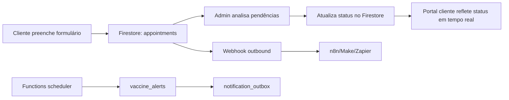

# Arquitetura: Firebase + Cloud Functions + Webhook

## Visão geral

A aplicação Prime Pet opera com front-end estático e backend serverless no Firebase.

Componentes principais:
- **Frontend:** `index.html`, `client.html`, `admin.html`, `dashboard.html`
- **Auth:** Firebase Authentication (Google/e-mail)
- **Dados transacionais:** Cloud Firestore
- **Automação:** Firebase Cloud Functions (`functions/index.js`)
- **Integração externa:** Webhook HTTP (n8n/Make/Zapier/outros)

## Fluxo ponta-a-ponta

## Coleções de dados (referência)

- `appointments`
  - Registra agendamentos, status, data/hora, tutor e pet.
- `profiles`
  - Preferências e metadados de cliente.
- `admin_users`
  - Controle de acesso administrativo complementar às custom claims.
- `vaccine_alerts`
  - Fila de lembretes agendados.
- `notification_outbox`
  - Caixa de saída para integração assíncrona com canais externos.

## Cloud Functions (papel)

- **`enqueueVaccineAlert`**
  - Recebe solicitações para agendar lembretes de vacina.
  - Persiste itens em `vaccine_alerts`.

- **`dispatchVaccineAlerts`**
  - Executa periodicamente.
  - Coleta alertas elegíveis e envia para `notification_outbox`.
  - Permite worker externo processar WhatsApp/e-mail sem acoplamento no front-end.

## Webhook de integração

Objetivo:
- Notificar ferramentas de automação quando houver eventos relevantes (ex.: novo agendamento pendente).

Boas práticas:
1. **Idempotência:** envie `eventId` único para evitar duplicidade.
2. **Assinatura:** usar token/assinatura HMAC no header.
3. **Timeout curto + retry exponencial:** evitar travar UI/admin.
4. **Observabilidade:** registrar status HTTP, latência e payload mínimo para auditoria.
5. **DLQ manual:** em falhas recorrentes, mover para fila de reprocessamento.

## Segurança

- Firestore Rules com leitura/escrita por `ownerUid` e exceção controlada para admins.
- `admin_users/{uid}` como segunda camada de autorização.
- Dados sensíveis minimizados em logs e payload de webhook.

## Operação e suporte

Checklist mínimo de incidente:
1. Validar saúde das Functions e últimos logs.
2. Conferir backlog em `notification_outbox`.
3. Verificar disponibilidade do endpoint webhook.
4. Reprocessar eventos com falha por lote controlado.

## Evoluções sugeridas

- Adicionar correlação distribuída (`traceId`) no fluxo completo.
- Criar painel de SLA do webhook (sucesso, erro, retries, p95 latência).
- Definir política de retenção e anonimização de dados antigos.
